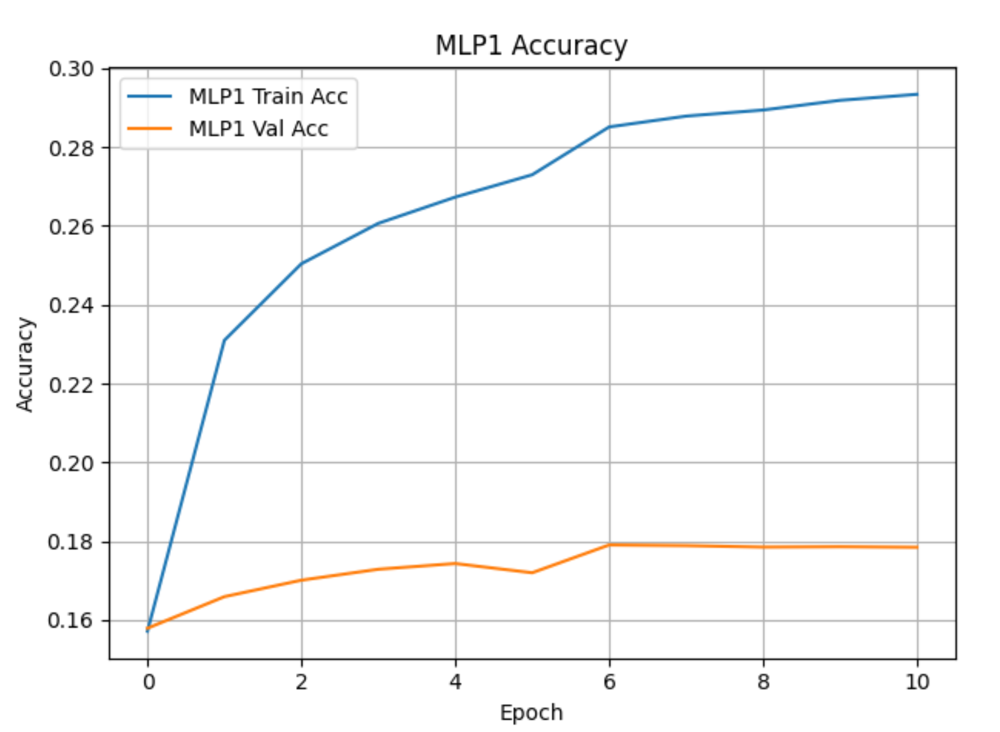
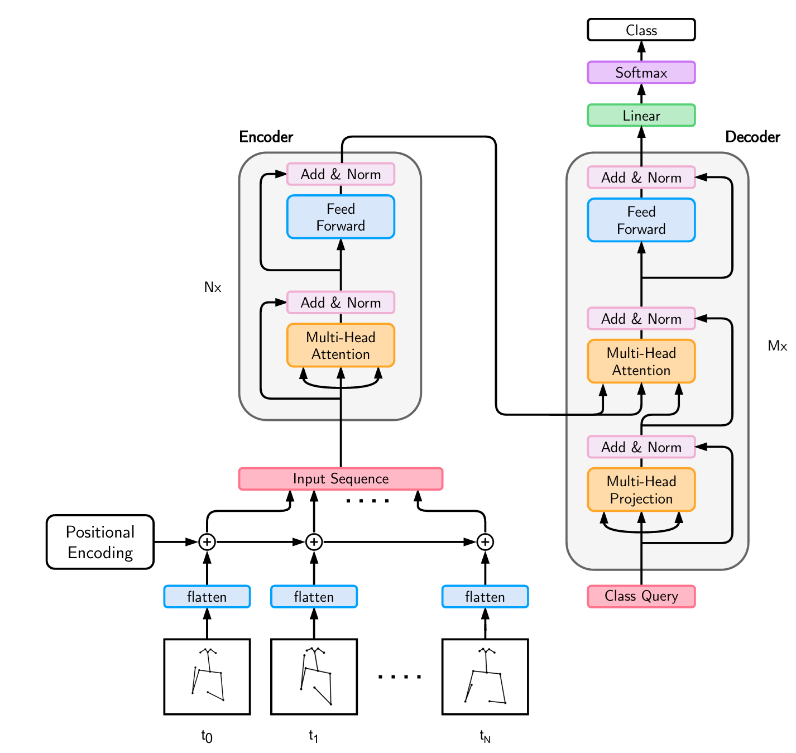

# 🆕 Important Update

📁 It was added the "results" folder with all the data, figues and images from the training and test from the model with the MS-ASL 1000 dataset.


ASL Recognition

Final project for the 2025 Postgraduate course on Artificial Intelligence with Deep Learning, UPC School, authored by Enrique Bermejo, Enric Dorca, Daniel Muelle and Carles Vila.

Advised by Amanda Duarte.

##

## INTRODUCTION

**Over 460 million people around the world are deaf or hard-of-hearing, representing a significant portion of the global population.** This diverse community includes individuals with varying degrees of hearing loss, ranging from mild to profound. Many of them face unique challenges in communication, education, employment, and access to public services.

**Of this population, more than 70 million people are deaf and use sign language as their primary means of communication.** These individuals rely on visual language systems that are rich, complex, and fully capable of expressing abstract ideas, emotions, and technical concepts. There are over 300 different sign languages used worldwide, each with its own grammar, vocabulary, and cultural significance. These languages are not universal; they evolve naturally within communities and are deeply rooted in local culture and history.

**Despite the prevalence and importance of sign languages, many deaf individuals still face barriers to communication and inclusion.** Limited access to sign language interpreters, a lack of awareness in the hearing population, and inadequate support in education and healthcare systems contribute to social and economic inequalities.

Recognizing and supporting sign language users is essential for building a more inclusive world where deaf and hard-of-hearing individuals can fully participate in society, access information, and express themselves without barriers.

## **MOTIVATIONS**

### Inclusion

The primary motivation is to bridge the communication gap between the deaf and hearing communities.

### Impact

Breaking down communication barriers, **SLR AI** helps Deaf and hearing communities understand each other better and interact more easily.

### Application

The primary drive behind this Sign Language Recognition (SLR) AI project is the urgent need to translate advanced technological capabilities into tangible, user-friendly tools that directly address real-world communication barriers for the Deaf and hard-of-hearing community.

##

## **GOALS/MILESTONES**

The main goal of this project is to develop a robust deep learning–based system for isolated American Sign Language (ASL) recognition. The work focuses on leveraging multimodal data and evaluating model performance across datasets of increasing complexity. The specific objectives are:

- Create a deep learning–based model for isolated American Sign Language recognition.
- Effectively process and extract features from multimodal input such as hand and body landmarks.
- Train models using MS-ASL 100 to evaluate performance on a small and manageable vocabulary set.
- Train models using MS-ASL 200 to assess scalability as the number of classes increases.
- Train models using MS-ASL 1000 to test generalization and robustness on a large and diverse dataset.

## **DATASET**

The data we used to train and validate our model has been the MS-ASL (Microsoft AmericanSign Language.

The **MS-ASL** dataset is a large-scale, real-life dataset designed for advancing research in **sign language recognition**. It contains over **25,000 annotated videos** of American Sign Language (ASL) signs, making it one of the most comprehensive datasets in this domain. The dataset is particularly valuable for training machine learning models due to its diversity and scale.

**Key Features**

- **Large Vocabulary**: The dataset includes **1,000 unique signs**, covering a wide range of vocabulary.
- **Diverse Signers**: It features recordings from over **200 signers**, enabling robust generalization to unseen individuals.
- **Realistic Conditions**: Videos are captured in unconstrained, real-life settings, making the dataset suitable for practical applications.

At crunch time, the number of downloadable videos turned out to be lower. This is the summary of usable clips:

**Training**: 12808 (1000 signs. The word with more signs is “eat“ with 43 clips. Average is 12 clips)

**Validation**: 3258 (920 signs. The word with more signs is “happy” with 17 clips. Average is 4 clips)

**Test**: 2832 (932 signs. The word with more signs is “hello” with 17 clips. Average is 3 clips)

The official sizes of the MS-ASL dataset are: 100, 200, 500 and 1000 signs. You can find the 1000 classes in the file MSASL_classes.json and they appear in the order of frequency. If you only require the classes of the MS-ASL 100 you only have to take the first 1000, and the same way for the other sizes.


## MEDIAPIPE

**MediaPipe** is an open-source framework developed by **Google** for building real-time, cross-platform **machine learning** and **computer vision** solutions, especially focused on video and image analysis.

### **Key Features:**

- Real-time performance: Optimized for applications like augmented reality, filters, gesture recognition, etc.

- Cross-platform: Works on Android, iOS, web (via WebAssembly), and desktop (Windows, macOS, Linux).

- Modular pipeline architecture: Uses customizable "graphs" made up of different processing blocks called calculators.

- Pre-built solutions: Includes ready-to-use ML models and tools for:

  - Hand Tracking

  - Face Mesh

  - Pose Estimation

  - Holistic Tracking (face + hands + body)

  - Objectron (3D object detection)

  - Selfie Segmentation

### **💡 Common Use Cases:**

- Augmented reality and virtual try-ons

- Gesture and face recognition

- Fitness apps (e.g. posture tracking)

- Touchless user interfaces

- Real-time background removal

### **🛠️ Technology Stack:**

- Built-in support for TensorFlow Lite

- GPU and CPU acceleration

- Web deployment with WebAssembly and WebGL


##

## COMPUTATIONAL RESOURCES

Google Virtual Machine g2-standard-4

4 virtual CPUs, 16 GB

1 NVIDIA L4 GPU, 24GB of GPU Memory

Lenovo Legion Pro 5

AMD Ryzen 9, 32 GB

1 NVIDIA RTX 5060, 8GB of GPU Memory

Lenovo Ideapad 3

Intel Core i7-12650H, 16GB  
NVIDIA RTX 3050, 8GB of GPU Memory

##

## IMPLEMENTATION: KEY FRAME MLP MODEL

### Introduction

Normally in the video of a language sign there is only one or few key frames/images. The rest only add confusion. So we decided to try to train an MLP to infer the sign from each frame instead of all the video. Therefore the model/algorithm begins to loop through the csv frames to find the frame that gets the maximum probability of some sign at its output. The results of the trial were positive enough.

So next, we decided that with a second key frame it would be more probable to recognize the signs. So, we added a second MLP that at its input gets the key frame selected by the first MLP plus another frame from the csv/video. So this second MLP also loops through the csv frames and we get the maximum probability/sign at its output.

Therefore the first MLP has to be trained first and the second afterwards. We could add more MLP’s to get more key frames in this way. The only drawback is that the model needs some more time to train/infer.

Graphically it would be like this:

Video => CSV (with mediapipe coordinates) => Preprocess/normalization with angle extraction, speeds…


Also, to get some of the gesture dynamics we compute the change/increment between consecutive frames in the input features in the preprocess. Also when concatenating the input frames of the MLP 2 we use the same order as de number/position of the frame.

MLP is a simple but a good model to recognize static frames… Also with the preprocess/normalization with angles… we do before it’s easier for the MLP to do its job.

###

### Key Features

#### Data augmentation

We decided in this model to use the “mirror” data augmentation because it doubles the number of samples we have for the training and also lets us to manage the problem with the left and right handed people. Also in the MS-ASL there are left-handed signers.

#### Preprocess

In this model we decided to try extracting the angles and only certain important coordinates (as the hands base) to normalize the features and ease the work from the model. Also it permits to reduce the number of inputs to the MLP’s.

Also we normalize the few coordinates with the shoulder landmarks from the “pose” from mediapipe. So we get independent from the size or distance of the sign from the camera.

In the end we didn’t use the “face” landmarks from mediapipe because there were too many and we could use the pose landmarks from the face.


Here we have some graphic results from the test to see how it works. For each test file we can see the two key frames selected by MLP1 and MLP2, and its probability (0-1). (Internally the model works with preprocessed features, not images or normal mediapipe coordinates)


It can be seen as the MLP2 helps to improve significantly the result of the MLP1 alone (increasing the probability or correcting the MLP1 sign)

###

### Model Explanation

###


###

1. **Video Input:** The model starts by taking a set of **videos** as its initial input.
2. **MediaPipe Preprocessing:** Each **frame** from these videos is individually processed using **MediaPipe**. This step extracts relevant features (e.g., hand, body, or face landmarks), which form the initial tensors for each frame.
3. **Features Preprocessing.** Data augmentation and normalization.
4. **MLP 1 Module (Best Frame Selection):**
   - A first **Multi-Layer Perceptron (MLP 1)** takes the extracted frame features (and potentially a representation of the word being searched for) as input.
   - Its role is to identify the **"best frame"** within a video that most accurately represents the given word.
   - This MLP 1 outputs **the best frame** and a **"Best Result" (R_1)** associated with its selection.
5. **Concatenation and MLP 2 Processing:**
   - For _each individual frame's features_ (from MediaPipe), the **representation of the "best frame"** (determined by MLP 1) is concatenated.
   - The **concatenation is temporal**: it's added to the front of the current frame's tensor if the current frame appears _before_ the "best frame," or to the back if it appears _after_. This provides temporal context to the model.
   - These **modified (concatenated) tensors** are then fed into a second Multi-Layer Perceptron (MLP 2).
   - MLP 2 processes each modified tensor, producing a **result (r_i)** for each frame.
   - From all the results generated by MLP 2 for each frame, the **maximum value (R_2)** is selected, representing the best result that MLP 2 found across all frames.
6. **Final Output:**
   - Finally, the system compares the **"Best Result" (R_1)** obtained directly from MLP 1 with the **"Best Result" (R_2)** obtained from MLP 2 (the maximum among the per-frame results).
   - The **final output of the model** is the maximum value between R_1 and R_2.

### Results

The **test accuracies** we got are:

|                 | **MLP 1** | **MLP1 + MLP2** |
| --------------- | --------- | --------------- |
| **MS-ASL 100**  | 82,18%    | 91,38%          |
| **MS-ASL 200**  | 75,80%    | 85,35%          |
| **MS-ASL 500**  | 56,53%    | 76,38%          |
| **MS-ASL 1000** | 44,75%    | 64,91%          |

Because our model can be seen as an algorithm that uses two MLP’s models and searches for the best key frames, it is normal that the next graphics are not very good but the major part of frames do not have a clear class/sign winner (with a high probability).




As an example we show confusion matrix for MSASL 100.


### Conclusion

This Key frame MLP model, as we named it, has become the model with the best test accuracy from all. It came from a simple idea and using only MLP’s, that on the other hand are good for static images and frames. Some other models have “attention” for giving more importance to some “tokens”. Our model does something similar but looking each frame to find the best key frames.

Also it has the advantage that it does not normalize the number of frames so it does not lose any frame and no frame is changed in some way. Our model adapts without problem to any video length.

Another feature of our model is that it is designed also to get the dynamic information of the mediapipe. It preprocesses and adds the speed or increment of features between each two consecutive frames. Also the concatenation of the frames in the input of MLP2 is done with the same order of the frame number/position.

Also we have done data augmentation mirroring the videos/csv’s so our model is trained well for left-handed people also.

For now we have tried with two MLP’s and we have got very good results. We could try in the future with a third MLP…

Our model has the advantage that it does not normalize the number of frames so it does not lose any frame and no frame is changed in some way. Our model adapts without problem to any video length.

Also is designed to get the dynamic information of the mediapipe. It preprocesses and adds the speed or increment of features between each two consecutive frames. Also the concatenation of the frames in the input of MLP2 is done with the same order of the frame number/position.

Another advantage is we have done data augmentation mirroring the videos/csv’s so our model is trained well for left-handed people also.

Perhaps because the MS-ASL dataset does not have a lot of samples per sign, our model with MLP’s does better than other more complex.

## **DEAD END EXPERIMENTS**

### LSTM

**Hypothesis:** The hypothesis is that an LSTM-based model can effectively classify isolated American Sign Language (ASL) signs from the MSL dataset, even with a limited number of short video samples per class. The temporal nature of the data should allow the LSTM to capture the sequential movement patterns characteristic of different signs.

**Experiment setup:** The experiment consists of training a Long Short-Term Memory (LSTM) neural network to classify 25 different ASL signs from the MSL (Multimodal Sign Language) isolated dataset. Each video in the dataset represents a single sign and is represented by 150 frames of hand landmarks (21 keypoints per hand, 42 values per frame using only x and y coordinates).  
The architecture of the model includes: input layer, LSTM layers to capture temporal dependencies and Dense layers for classification into 25 classes.

The dataset is imbalanced and contains a relatively small number of samples per class, which was a key variable tested in this experiment.

**Results:** The LSTM model achieved an accuracy of less than 30%, which is significantly below an acceptable threshold for practical use. Analysis of the confusion matrix reveals a high rate of misclassification, particularly among signs with visually similar motion patterns or low sample count. Overfitting was observed during training, with training accuracy much higher than validation accuracy.


**Conclusion:** The results suggest that the current dataset is insufficient in size and diversity to train a reliable LSTM model for ASL sign classification. The poor performance highlights the need for either:

- Augmenting the dataset to balance and increase the number of samples per class. Maybe data augmentation or transfer learning techniques could mitigate the effects of data scarcity.

- Trying alternative architectures (e.g., attention-based Transformers or CNN-LSTM hybrids) that may generalize better

- Pretraining on a larger sign language dataset before fine-tuning on MSL

### LSTM + Data Augmentation

**Hypothesis:** The hypothesis is that applying data augmentation techniques such as shifting, scaling, and adding noise to the original MSL dataset would effectively increase the training set size and diversity, allowing the LSTM model to generalize better and achieve higher classification accuracy.

**Experiment setup:** This experiment used the same LSTM architecture as in previous tests to classify 25 ASL signs from the MSL dataset. Since the original dataset had too few and unevenly distributed samples per class, data augmentation was applied to artificially increase and **balance** the dataset.  
The final dataset was constructed with a fixed number of samples per class: 140 training samples, 30 validation samples and 30 test samples.The augmentation techniques applied to generate new samples included:

- **Shift**: small translations in the hand landmark positions
- **Scale**: zoom in/out effects on the coordinate space
- **Noise**: random Gaussian noise added to landmark values  
   Each video sequence was standardized to 90 frames of 42 values (21 keypoints per hand, x and y only).

**Results:** Despite the increased dataset size and the effort to balance the number of samples per class, the model achieved only about **34% accuracy**, which is only a minor improvement over the 30% obtained using the original unbalanced dataset.  
The confusion matrix showed that many classes were still frequently misclassified, suggesting that the model struggled to differentiate between signs even with more training data. Additionally, the learning curves displayed a high variance between training and validation accuracy, indicating possible overfitting or poor generalization.

One likely cause is the **nature of the data augmentation itself**: in particular, the addition of random noise to the hand landmark coordinates may have **introduced unrealistic or ambiguous gestures**, effectively confusing the model rather than helping it learn robust patterns. This could explain why the model failed to achieve the expected improvement in performance despite the larger and balanced dataset.


**Conclusions:** Despite equalizing the number of samples per class, the accuracy remained low at around 34%. This indicates that **the type of augmentation is critical**: methods such as shifting, scaling, and adding noise may alter the temporal dynamics or spatial structure in ways that reduce gesture clarity, making them ineffective or even harmful for training LSTM models.  
Additionally, this result reinforces the importance of collecting more real samples or exploring **transfer learning** approaches instead of relying solely on synthetic data generation to balance the dataset.

### LSTM + Greek Dataset

**Hypothesis:** The hypothesis is that an LSTM model trained on a dataset with a sufficient number of video samples per class (around 250) will achieve significantly better classification accuracy than when trained on a smaller dataset. This would demonstrate the importance of dataset size and balance in sequence-based sign language recognition tasks.  
In this experiment it is used the [Greek Sign Language (GSL) dataset](https://vcl.iti.gr/dataset/gsl/), which is a large RGB+D video dataset for Sign Language Recognition, recorded with 7 signers and annotated by experts. It includes 10,290 sentence instances and 310 unique classes. A subset with 20 isolated sign classes is available and was used in this case. The dataset provides RGB and depth data captured at 30 fps with 848×480 resolution.

**Experiment setup:** This experiment uses an LSTM neural network to classify 20 isolated signs from the Greek Sign Language (GSL) dataset. Each video sample is preprocessed into 90 frames of hand landmark coordinates (42 values per frame, using x and y for 21 points per hand).

**Results:** The LSTM model achieved an accuracy close to 80% on the GSL dataset. This is a substantial improvement over the 30% accuracy obtained on the MSL dataset. The model shows consistent generalization across classes, with lower confusion rates and a more balanced precision and recall profile.


**Conclusions:** These results confirm the hypothesis that the number of samples per class significantly influences model performance. With a more extensive and balanced dataset, the LSTM model can effectively learn the temporal patterns of different signs.

This comparison highlights a key limitation of the MSL dataset—its small number of videos per class. As a result, a new hypothesis emerges: increasing the volume and class balance of MSL through data augmentation or further collection will lead to a performance boost comparable to GSL.

Additionally, the success of the LSTM on GSL suggests that the architecture is suitable for the task, and that future improvements should prioritize data quantity and diversity rather than model complexity alone.

### ResNet 2+1


**Hypothesis:** The R(2+1)D network enhances video understanding by improving traditional 3D CNNs. It decomposes 3D convolutions into two simpler operations:

1. 2D Spatial Convolution: Extracts spatial features (height and width) within each frame.
2. 1D Temporal Convolution: Captures motion dynamics across frames (time).

This decomposition introduces non-linearity between spatial and temporal processing, improving learning efficiency. Residual connections further enhance the model by allowing shortcut paths, enabling stable training and effective feature propagation even in deeper networks.

The network follows a ResNet-inspired architecture, organizing layers into blocks to capture spatial and temporal features hierarchically. It processes video tensors of shape (batch_size, channels, sequence_size, height, width) and outputs action class predictions, making it efficient and powerful for video recognition tasks.

For detailed specifications, refer to the [original paper](https://arxiv.org/pdf/1711.11248).

**Experiment setup:**

- the 101 words with more training samples
- frame size 224x224
- 30 frames per clip and
- 80 epochs

**Results:** With a Top 1 of less than 20% we concluded this was not the right path.


**Conclusions:** These results confirm that the model is "memorizing" the training dataset but is unable to make inferences on the validation dataset. This is due to the fact that the datasets contain very few videos per sign and that the overlap between signs in the training, validation, and test datasets is small. The other conclusion is that training this model has consumed a lot of resources and time (Days of execution of Google VM with GPU support).

### The Spoter Transformer

###

**Hypothesis:** **SPOTER (Sign Pose-based Transformer for Recognition)** is a Transformer-based model specifically designed for **spotting and recognizing isolated or continuous sign language gestures**. It leverages **pose data**, primarily hand landmarks, to recognize ASL (or other sign languages) more efficiently and with less reliance on raw video frames. SPOTER focuses on interpreting the **temporal evolution** of sign gestures, making it well-suited for spotting signs from continuous motion.

Key Concepts:

1. **Pose-Based Input**
   SPOTER uses **pose landmarks** extracted from signers' hands (and sometimes body and face) instead of raw images or video. This reduces noise and computational load while retaining essential gesture information.

2. **Transformer Architecture**
   The model employs the **Transformer** architecture, originally introduced in the "Attention Is All You Need" paper. Transformers use **self-attention** to model dependencies across time, allowing SPOTER to capture complex temporal relationships in hand motion data.

3. **Sign Spotting**
   Unlike general classifiers, SPOTER includes a spotting mechanism that **detects where in a sequence a sign occurs**, even in continuous video. It can distinguish between signing and non-signing motion.

We can find a deeper explanation in the paper [Sign Pose-Based Transformer for Word-Level Sign Language Recognition](https://openaccess.thecvf.com/content/WACV2022W/HADCV/papers/Bohacek_Sign_Pose-Based_Transformer_for_Word-Level_Sign_Language_Recognition_WACVW_2022_paper.pdf).

Advantages of SPOTER

- **Efficiency**: Pose-based input is lightweight and efficient compared to processing full video frames.

- **Interpretability**: Using human pose landmarks makes the system easier to interpret and debug.

- **Temporal Attention**: The Transformer’s attention mechanism captures subtle time-based patterns in sign gestures.

- **Scalability**: Works for isolated sign recognition and spotting in continuous sequences.

Challenges and Limitations

- **Pose Extraction Errors**: Inaccurate or missing pose data can affect model performance.

- **Data Requirements**: Transformers require large datasets to generalize well.

- **Lack of Context**: Pure pose-based input may miss facial expressions or contextual nuances important in sign language.

**Experiment setup:**

Data augmentation:

We used rotation through z axis to the left and to the right (15 degrees). So we get three times more samples.

Data preprocess:

We calculated the angles between fingers and for each finger, and also some important coordinates from the base of the hands and some palm angles to help the Spoter model job. Also we normalized respect to the shoulder landmarks.



1. **Input Representation**

   - Input to the model is a sequence of **pose vectors** representing the keypoints (e.g., from MediaPipe or OpenPose).

   - Each frame is a vector of 2D or 3D coordinates: frame_t = \[x₁, y₁, x₂, y₂, ..., xₙ, yₙ\] for n keypoints.

2. **Positional Encoding**
   Since Transformers lack inherent temporal order, **positional encodings** are added to the pose sequence to retain the notion of time.

3. **Encoder Layers**
   The pose sequence is passed through multiple Transformer **encoder layers**, each consisting of:

   - Multi-head self-attention

   - Layer normalization

   - Feed-forward networks

4. **Sign Classification Head**
   After encoding the entire sequence, a **classification head** (often a fully connected layer or softmax) is used to predict the **sign class** or determine whether a sign is present.

5. **Spotting Module**

   - A separate module or token (like a \[SIGN\] token) may be used to **indicate where in the sequence the sign occurs**.

   - The model can be trained with **start-end annotations** or weak supervision (e.g., only knowing which sign appears, but not where).

**Results:**

For 100 classes Test Accuracy (video): 62.25%


For 1000 classes/signs from MS-ASL  Test accuracy: 37%

**Conclusions:** We saw the results were not bad but the KEY Frames MLP model was better. And perhaps due to the lack of samples in the dataset this model didn’t had as good accuracy as Key Frames MLP model.

## STATE OF THE ART

To be able to compare our model results we have searched for the current “state of the art” for the ASL recognition using MS-ASL 1000 and Mediapipe only (like our model). As it can be seen the results with mediapipe models is a lot more modest than with the video/image itself:

🏆 Reported Performance on MS-ASL 1000 (MediaPipe Only)

| **Model**                            | **Inputs**            | **Top-1 Accuracy** | **Notes**                                        |
| ------------------------------------ | --------------------- | ------------------ | ------------------------------------------------ |
| **ST-GCN (on MediaPipe pose+hands)** | 2D skeleton landmarks | ~45–48%            | Graph over body + hands; uses temporal edges     |
| **GRU with MediaPipe landmarks**     | 2D hand + pose        | ~42–46%            | Handcrafted temporal sequences + RNN             |
| **Transformer on Landmark Seq**      | 2D/3D pose seq        | ~46–50%            | Positional encoding over MediaPipe landmarks     |
| **Hybrid (MLP + RNN)**               | MediaPipe landmarks   | ~40–44%            | Real-time capable, used in low-resource settings |

📌 These numbers are **approximate**, compiled from papers and reproducible GitHub repositories using only landmark-based inputs (usually 2D, sometimes 3D when depth is inferred or approximated).

## CONCLUSIONS

1. Key frame MLP model, as we named it, has got a very high with a test accuracy of 65% for MS-ASL 1000. It came from a simple idea and using only MLP’s, that on the other hand are good for static images and frames. Some other models have “attention” for giving more importance to some “tokens”. Our model does something similar but looking each frame to find the best key frames.
2. Through experiments with LSTM and SPOTER, we **confirmed the critical role of dataset size and class balance**: the same LSTM model that failed on MSL (30%) reached ~80% accuracy when trained on the Greek Sign Language (GSL) subset with 20 well-populated classes.
3. We **learned deeply about pose-based modeling, Transformers, MLPs, and LSTM architectures**, and how preprocessing (e.g., angle extraction, speed computation, data normalization) can significantly impact model performance in sign language tasks.
4. Finally, we saw the limitations of augmentation techniques like noise or scale shifts and identified that **real data quality and smart preprocessing** are more impactful than synthetic expansion when working with temporal pose sequences.
5. Sometimes, the simplest solution is also the most effective. While complex or cutting-edge approaches may seem more attractive, our results confirm that straightforward methods—when well applied—can outperform more elaborate alternatives. It’s a reminder that innovation doesn’t always mean complexity, and that clarity and focus often lead to the best outcomes.

## NEXT STEPS

- **Dataset Expansion**
  Build a custom dataset with significantly more videos per class to enhance model generalization and performance.

- **Real-Time System Integration**
  Deploy the model in a real-time environment to assess latency, responsiveness, and robustness under practical conditions.
- **User-Centric Evaluation**

Involve native signers or interpreters to validate system accuracy and gather qualitative feedback on usability and reliability.

- **Use continuous sign language**

Extend the current system to handle continuous sign language recognition, where signs are performed in natural, unsegmented sequences. This would involve adapting the model to detect and classify signs within a stream, simulating real-world conversations.

- **Improve the our model, e.g. increase the number of MLPs** of the Key frame MLP model to see what improvement can be achieved

##

# Setup environment

1. Create a Conda environment which uses Python 3.9

   ```bash
   conda create -n ENVIRONMENT_NAME python=3.9 -y
   ```

2. Activate the newly created environment.

   ```bash
   conda activate ENVIRONMENT_NAME
   ```

3. Install dependencies.

   ```bash
   pip install -r requirements.txt
   ```

# Update requirements

**DO THIS ONLY** every time a new library or dependency is added to the Conda environment in order to keep a track of them and ensure
it also works for future usages of this repository.

```bash
pip list --format=freeze > requirements.txt
```

# Guide

If you are starting to use this scripts, it is highly recommended that you follow the scripts in the order specified below:

## 1. Dataset Slicer

### Description

The **Dataset Slicer** script is designed to process the MS-ASL dataset by slicing a JSON dataset file into smaller subsets based on the number of classes. This is particularly useful for managing large datasets by limiting the number of classes for training or evaluation purposes. The script groups dataset entries by their **label** property, sorts them, and slices the dataset to include only the specified number of classes. The resulting sliced dataset is saved as a new JSON file.

### Arguments

The script accepts the following command-line arguments:

- **--dataset_dir**

  - **Description**: Specifies the relative path to the MS-ASL dataset directory from the current terminal location.
  - **Type**: `str`
  - **Default**: `MS-ASL-Dataset`

  Example:

  ```bash
  --dataset_dir "./MS-ASL-Dataset"
  ```

- **--dataset_file**

  - **Description**: The name of the JSON dataset file to slice.
  - **Type**: `str`
  - **Default**: `MSASL_test.json`

  Example:

  ```bash
  --dataset_file "MSASL_train.json"
  ```

- **--max_classes**

  - **Description**: The maximum number of classes to include in the sliced dataset.
  - **Type**: `int`
  - **Default**: `100`

  Example:

  ```bash
  --max_classes 50
  ```

### Usage Example

To run the script with custom arguments:

```bash
python dataset_slicer.py --dataset_dir "./MS-ASL-Dataset" --dataset_file "MSASL_train.json" --max_classes 50
```

This command will:

1. Look for the dataset file `MSASL_train.json` in the `./MS-ASL-Dataset` directory.
2. Slice the dataset to include only the first 50 classes.
3. Save the sliced dataset as a new JSON file in the same directory.

## 2. Dataset Extractor

### Description

The **Dataset Extractor** script is designed to process the MS-ASL dataset by downloading videos from the dataset JSON file and optionally editing them to extract specific clips based on the start and end times provided in the dataset. This script also generates a report of any failed downloads, making it easier to track issues during the extraction process. The downloaded videos and reports are saved in specified directories.

### Arguments

The script accepts the following command-line arguments:

- **--dataset_dir**

  - **Description**: Specifies the relative path to the MS-ASL dataset directory from the current terminal location.
  - **Type**: `str`
  - **Default**: `./MS-ASL-Dataset`

  Example:

  ```bash
  --dataset_dir "./MS-ASL-Dataset"
  ```

- **--dataset_file**

  - **Description**: The name of the JSON dataset file to process.
  - **Type**: `str`
  - **Default**: `MSASL_test_sliced.json`

  Example:

  ```bash
  --dataset_file "MSASL_train_sliced.json"
  ```

- **--videos_dir**

  - **Description**: Specifies the relative path to the output directory where the downloaded videos will be saved.
  - **Type**: `str`
  - **Default**: `./videos`

  Example:

  ```bash
  --videos_dir "./videos"
  ```

- **--reports_dir**

  - **Description**: Specifies the relative path to the output directory where the reports will be saved.
  - **Type**: `str`
  - **Default**: `./reports`

  Example:

  ```bash
  --reports_dir "./reports"
  ```

### Usage Example

To run the script with custom arguments:

```bash
python dataset_extractor.py --dataset_dir "./MS-ASL-Dataset" --dataset_file "MSASL_train_sliced.json" --videos_dir "./videos" --reports_dir "./reports"
```

This command will:

1. Look for the dataset file `MSASL_train_sliced.json` in the `./MS-ASL-Dataset` directory.
2. Download the videos specified in the dataset file and save them in the `./videos` directory.
3. Edit the videos to extract clips based on the start and end times provided in the dataset.
4. Save a report of any failed downloads in the `./reports` directory.

## 3. Dataset Processor

### Description

The **Dataset Processor** script is designed to process the MS-ASL dataset by analyzing each video using MediaPipe Holistic and extracting the landmarks for the face, pose, and hands. These landmarks are saved as JSON files for further analysis or use in machine learning models. The script ensures that all videos in the specified directory are processed and their corresponding landmarks are saved in the output directory.

### Arguments

The script accepts the following command-line arguments:

- **--videos_dir**

  - **Description**: Specifies the relative path to the directory containing the videos to be processed.
  - **Type**: `str`
  - **Default**: `./videos`

  Example:

  ```bash
  --videos_dir "./videos"
  ```

- **--landmarks_dir**

  - **Description**: Specifies the relative path to the output directory where the landmarks of each video will be saved.
  - **Type**: `str`
  - **Default**: `./landmarks`

  Example:

  ```bash
  --landmarks_dir "./landmarks"
  ```

### Usage Example

To run the script with custom arguments:

```bash
python dataset_processor.py --videos_dir "./videos" --landmarks_dir "./landmarks"
```

This command will:

1. Look for video files in the `./videos` directory.
2. Process each video using MediaPipe Holistic to extract landmarks for the face, pose, and hands.
3. Save the extracted landmarks as JSON files in the `./landmarks` directory.
4. Log the processing status for each video, including any errors or skipped files.

## 4. Dataset Cleaner

### Description

The **Dataset Cleaner** script processes the extracted landmarks JSON files for each video, ensuring that all frames have the correct number of landmarks for the face, pose, left hand, and right hand. If any landmarks are missing in a frame, the script fills them with zero coordinates. The cleaned and flattened landmarks for each video are then converted into PyTorch tensors and saved as `.pt` files for efficient loading in future machine learning workflows.

### Arguments

The script accepts the following command-line arguments:

- **--landmarks_dir**

  - **Description**: Specifies the relative path to the directory containing the extracted landmarks JSON files.
  - **Type**: `str`
  - **Default**: `./landmarks`

  Example:

  ```bash
  --landmarks_dir "./landmarks"
  ```

- **--tensors_dir**

  - **Description**: Specifies the relative path to the output directory where the cleaned tensor files will be saved.
  - **Type**: `str`
  - **Default**: `./tensors`

  Example:

  ```bash
  --tensors_dir "./tensors"
  ```

### Usage Example

To run the script with custom arguments:

```bash
python dataset_cleaner.py --landmarks_dir "./landmarks" --tensors_dir "./tensors"
```

This command will:

1. Look for landmarks JSON files in the `./landmarks` directory.
2. Process each file, filling missing landmarks with zero coordinates as needed.
3. Flatten and convert the cleaned landmarks into PyTorch tensors.
4. Save the resulting tensors as `.pt` files in the `./tensors` directory.
5. Log the processing status for each video, including any warnings about missing landmarks.

## 5. Labels Extractor

### Description

The **Labels Extractor** script scans a directory of PyTorch tensor files (typically generated by the Dataset Cleaner) and extracts the unique labels from the filenames. It assigns a unique integer identifier to each label and saves the mapping as a JSON file. This is useful for preparing label-to-index mappings for classification tasks.

### Arguments

The script accepts the following command-line arguments:

- **--tensors_dir**

  - **Description**: Specifies the relative path to the directory containing the tensor files (`.pt`).
  - **Type**: `str`
  - **Default**: `./tensors`

  Example:

  ```bash
  --tensors_dir "./tensors"
  ```

- **--labels_path**

  - **Description**: Specifies the relative output path for the labels JSON file.
  - **Type**: `str`
  - **Default**: `./labels.json`

  Example:

  ```bash
  --labels_path "./labels.json"
  ```

### Usage Example

To run the script with custom arguments:

```bash
python labels_extractor.py --tensors_dir "./tensors" --labels_path "./labels.json"
```

This command will:

1. Look for tensor files in the `./tensors` directory.
2. Extract the label from each tensor file's name (the part before the first underscore).
3. Assign a unique integer identifier to each unique label.
4. Save the label-to-identifier mapping as a JSON file at `./labels.json`.
5. Log the process, including the unique labels found and the output path.

## 6. MLP Model Scripts

### 6.1. convert_video2csv.py

**Description:**
This script processes a directory of video files, extracting pose, face, and hand landmarks from each frame using MediaPipe Holistic. For each valid video (filtered by a CSV list of names), it generates a CSV file containing the landmarks for every frame, along with frame index, timestamp, and the video label.

**Key Path Variables:**

- `carpeta`: Path to the directory containing the videos to process.
- `carpeta_csv`: Path to the directory where the output CSV files will be saved.
- `csv_lista`: Path to the CSV file listing valid video names.

**Note:**
These paths are hardcoded and should be modified to match your local environment before running the script.

---

### 6.2. csv_reverse_mirroring.py

**Description:**
This script takes CSV files generated by MediaPipe Holistic and creates mirrored versions. It reflects the X coordinates (x = 1 - x) and swaps the left and right hand landmark blocks. This is useful for data augmentation in sign language recognition tasks.

**Key Path Variables:**

- The script processes all CSV files in a specified directory. You should call the `reflejar_multiples_csvs(directorio)` function, passing the path to your CSV directory.

**Note:**
Update the directory path in your function call to match your environment.

---

### 6.3. process_csv.py

**Description:**
This script preprocesses the CSV files generated by the previous step. It extracts and normalizes features such as pose, hand angles, velocities, and palm normals, then saves the processed features into new CSV files. This step is essential for preparing the data for machine learning models.

**Key Path Variables:**

- `INPUT_FOLDER`: Path to the directory containing the original CSV files.
- `OUTPUT_PROCESSED_FOLDER`: Path to the directory where the processed CSV files will be saved.

**Note:**
Both paths are hardcoded and should be updated according to your dataset location.

---

### 6.4. model_inference.py

**Description:**
This script performs frame-level sign classification using precomputed features and a Keras MLP model. It loads processed CSVs for training, validation, and testing, applies label encoding and feature scaling, trains the model, and can perform inference. The script also supports saving models and generating output images.

**Key Path Variables:**

- `PROCESSED_TRAIN_FOLDER`, `PROCESSED_VAL_FOLDER`, `PROCESSED_TEST_FOLDER`: Paths to the processed CSV directories for train, validation, and test sets.
- `csv_filtro_signos`: Path to the CSV file listing allowed sign classes.
- `SAVED_MODEL_FOLDER`: Path where trained models will be saved.
- `output_img_folder`, `video_root_folder`, `original_csv_folder`: Paths for saving output images and referencing original data.

**Note:**
All these paths are hardcoded and must be adapted to your local setup before running the script.
