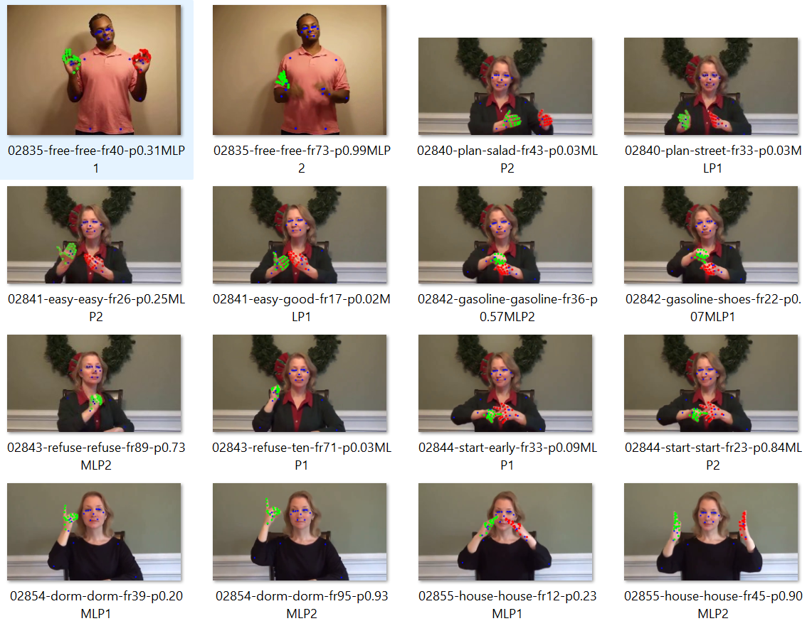

# Test Results for MS-ASL 1000

In the file "Test_Results_MS_ASL_1000.txt" you can see the final Test results for MS-ASL 1000

In the folder "test_frames_img_1000_mlp2_avg_class" there are all the images of the best frames selected by the model.

In the image file name (for example: 00018-cashier-athlete-fr8-p0.00MLP1.png) you can see: the image id, the correct sign, the infered sign, the frame number, the probability/confidence (0-1) from the inference and wether is the best frame from MLP1 or MLP2.
Really, at the end the model chooses the sign from MLP1 or MLP2 with the higher probability.

You also can download the results from Dropbox:

https://www.dropbox.com/scl/fo/binpeyyuk936qw7sx5on2/ABJ62cXAoH86P-r_oK7PLzs?rlkey=apw5e6elj46p8a7roi07fp0br&st=8rbnr7wf&dl=0

In the arXiv article, when explaining the Key Frame MLP model, the figure (mlp1_mlp2_examples.png) may not have been the most appropriate choice. But in the folder "test_frames_img_1000_mlp2_avg_class" there are all the test best frames selected by MLP1 and MLP2.

# 🆕 Important Update Dataset 12/8/2025:

We add here the links to the dataset files we have useed in the training (Dropbox):

In the "mp1000_mirror_proc" folder in videos_train and videos_val there are the csv files preprocesed needed for the training.

For videos_test is the folder "mp1000_proc"

videos_test:

https://www.dropbox.com/scl/fo/rh1xbuf5fvdlxdki9nrbw/AGHGGoI8gBlO_cf4WSexeqg?rlkey=k7841i8ecv9re8aykdvmrcilv&st=ri35k9qs&dl=0

videos_val:

https://www.dropbox.com/scl/fo/6z0vy4qqa8c49onwebdpp/ACifC3bw4tWe860SQ-e5BdU?rlkey=5j1nrk4x8px8hp4tuo435n46n&st=4tpq7wg1&dl=0

videos_train:

https://www.dropbox.com/scl/fo/5vg0ro1yvhd7wkjoomkqb/AOAcxVwMteKypObR4UcoTjs?rlkey=2ww99rqwvtzjy20oy6qid00s5&st=h61dwbqu&dl=0

